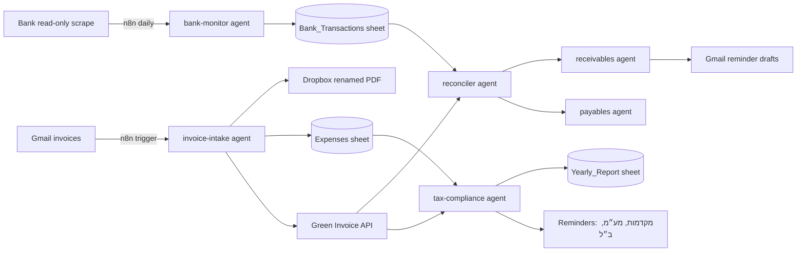

# Business Automation Architecture — n8n + Google Sheets + Cowork Agents

Goal: run the finance side of a small business (עוסק מורשה; a musician is the example) with minimal
manual work: invoice intake, bank monitoring, tax compliance, receivables (גבייה),
payables (ספקים), and a live projection of the annual report.

## Guiding principle: n8n does plumbing, agents do judgment

| Layer | Tool | Responsibility |
|-------|------|----------------|
| Triggers & transport | **n8n** | Gmail watch, schedules (cron), Dropbox upload, Sheets append, Green Invoice API calls, Telegram/email notifications |
| Judgment & language | **Cowork agents (Claude)** | Parse unknown invoices, categorize, match bank payments to invoices, draft Hebrew reminder emails, tax analysis, exception handling |
| Source of truth | **Google Sheets** (phase 1) → DB later | One workbook, schema in `DATA-SCHEMA.md`, designed to map 1:1 to database tables |
| Files | **Dropbox** | `חשבוניות - קבלות/<year>/<category>/` with the canonical filename convention `YYYY-MM-DD_type_vendor_desc_amount_currency.pdf` |
| Accounting system | **Morning / Green Invoice** | Issued invoices (source of truth for revenue), expense documents pushed via API |

Rule of thumb: if a step is deterministic (move file, append row, call API), it lives
in n8n. If a step needs reading comprehension or a decision, n8n calls a Cowork agent
(via Claude API / webhook) or the agent runs on a schedule inside Cowork.

## The six agents

All agent definitions live in `.claude/agents/` so Cowork can run them directly.

### 1. `invoice-intake` — collect & categorize every incoming invoice
- **Trigger:** n8n Gmail trigger (label/filter on invoice senders) or manual drop of a PDF.
- **Uses:** existing `invoice-expert` skill + `vendor-parsers/`.
- **Does:** extract fields → build canonical filename → tell n8n to: save renamed PDF to
  the right Dropbox category folder, append a row to `Expenses` sheet, push the expense
  document to Green Invoice via API.
- **Exception path:** unknown vendor → agent writes a new parser, updates
  `vendor-mapping.json`, flags for your one-tap approval.

### 2. `bank-monitor` — read-only bank watcher
- **Trigger:** n8n schedule (daily, e.g. 07:00) running `israeli-bank-scrapers`
  (read-only; credentials only in n8n credentials store / `.env`, never in the repo).
- **Uses:** `israeli-bank-connector` skill.
- **Does:** append new transactions to `Bank_Transactions` sheet; classify each credit as
  client payment / other income; classify debits (supplier payment, tax payment, personal).
- **Notifies:** "התקבל תשלום ₪X מ-Y" push when a credit matches an open invoice amount/client.

### 3. `reconciler` — match money to documents
- **Trigger:** runs after `bank-monitor` (chained in n8n).
- **Does:** match bank credits ↔ open Green Invoice documents (type 305/320/300 open
  balances); match debits ↔ supplier invoices in `Payables`. On match: mark invoice paid
  in the sheet (and receipt issued? flag if a קבלה still needs to be produced in Morning).
- **Unmatched after 3 days:** escalate to you with its best guess.

### 4. `tax-compliance` — the "account manager" (רואה חשבון וירטואלי)
- **Trigger:** Cowork Routine — weekly (Sunday morning) + on the 10th of each month.
- **Sources:** `deadline-calendar.json`, `freelancer-profile.json`, `Yearly_Report` sheet.
- **Does:**
  - Remind upcoming/overdue: מע״מ (bi-monthly, 15th), ביטוח לאומי (monthly, 15th), annual report.
  - **מקדמות מס check:** whether advances are required is recorded in the profile. Each
    run re-verifies: (a) has the Tax Authority issued an assessment? (b) does YTD profit
    trajectory imply you *should* be paying advances to avoid a year-end lump + interest?
    If projected annual tax > ~threshold, recommend voluntary מקדמות and the amount.
  - Watch thresholds: 874 detailed VAT report (₪500K turnover), invoice allocation numbers
    (מספר הקצאה) — ₪10K now, dropping to ₪5K June 2026.
- **Output:** short Hebrew status message; updates `Deadlines` sheet statuses.

### 5. `receivables` — payments you're owed (גבייה)
- **Trigger:** weekly (n8n schedule → agent).
- **Does:** pull open documents from Green Invoice API; compute aging (0-30/31-60/60+);
  cross-check against `Bank_Transactions` (maybe paid but no receipt issued). For overdue:
  draft a polite Hebrew reminder email per client — saved as Gmail draft for your review,
  never auto-sent (configurable to auto-send after N reminders).

### 6. `payables` — suppliers you owe
- **Trigger:** weekly, and 3 days before any due date.
- **Does:** track supplier invoices with due dates in `Payables` sheet (fed by
  invoice-intake when a document is a חשבונית עסקה / has payment terms); remind you what
  to pay this week; after payment appears in bank, `reconciler` closes it.
- **Never initiates payments** — reminders and a prepared payment list only.

### Cross-cutting: `yearly-report` reference
Not a separate agent — `tax-compliance` maintains the `Yearly_Report` sheet after every
run: YTD revenue (from Green Invoice), YTD deductible expenses (from `Expenses` with the
deduction ratios already encoded in `parse_expenses.py`), projected annual P&L, estimated
income tax + ביטוח לאומי liability, and VAT position for the current period. This is the
live answer to "how will my annual report look in December."

## Data flow (end to end)

## Security rules (non-negotiable)
- Bank access is **read-only scraping**; credentials live only in n8n's encrypted
  credential store or local `.env` (git-ignored). Never in the repo, sheets, or prompts.
- Agents never move money. Payables produces a checklist, not transfers.
- Green Invoice API keys in `.env` / n8n credentials only.
- Client emails are drafted, not sent, until you enable auto-send explicitly.

## Google Sheets vs. web app + DB — recommendation

**Phase 1-2: stay on Google Sheets.** At your volume (~150-200 documents/year, ~10
clients) a DB solves no real problem yet, and Sheets gives you free UI, mobile access,
sharing with the accountant, and trivial n8n integration. The schema in `DATA-SCHEMA.md`
is deliberately normalized (stable IDs, one entity per tab, no merged cells) so every tab
maps 1:1 to a future table.

**Phase 3 (optional, when it hurts):** migrate to Supabase (hosted Postgres) + a small
dashboard web app. Triggers to migrate: concurrent automation writes corrupting rows,
needing auth/roles, wanting a proper dashboard, or >5K rows/tab. Migration is then a
one-day job: CSV export → SQL import → repoint n8n nodes from Sheets to Postgres. The
agents don't change at all — they talk to n8n, not to the storage layer.

Building the web app *first* would spend weeks on CRUD screens before any automation
value ships. Ship the agents first; the platform can come later.

## Build order (see phases)

1. **Week 1 — Invoice intake:** Sheets workbook + n8n Gmail→agent→Dropbox/Sheets/GI flow.
   (Highest value, everything else reads this data.)
2. **Week 2 — Bank + reconcile:** daily scrape, transaction sheet, payment matching, "got paid" pushes.
3. **Week 3 — Compliance:** tax-compliance Routine, deadlines, מקדמות check, Yearly_Report tab.
4. **Week 4 — AR/AP:** receivables aging + reminder drafts; payables due-date tracking.
5. **Later:** weekly digest (one Sunday-morning message summarizing all of the above),
   optional Supabase migration + dashboard.
